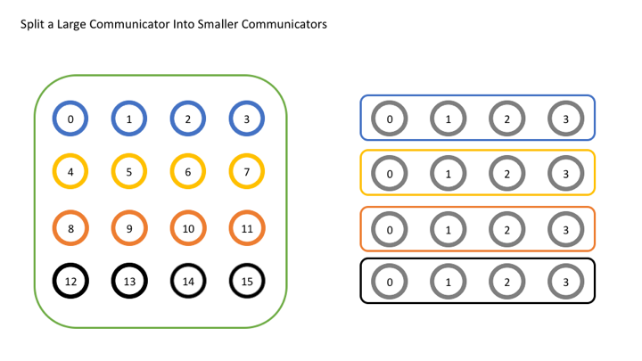

# Добрый день, группа 312!

### Группы и коммуникаторы
### Рассылка матрицы с использованием коммуникаторов
### Расчёт времени

andrey.zenzinov@math.msu.ru  

https://zenderro.github.io/programming-semester-6/

Используются примеры и изображения из https://mpitutorial.com/tutorials/introduction-to-groups-and-communicators/

<style>
div.left-column {
  width: 44%;
  float: left;
}
div.right-column {
  width: 44%;
  float: right;
}
div.small {
  font-size: 0.8em;
}
div.fullwidth img {
  width: 100% !important;
}
</style>

# Группы и коммуникаторы

*Группа* - некоторое упорядоченное множество процессов, у каждого есть свой ранг (номер).

*Коммуникатор* - идентификатор группы процессов.

Для простых задач достаточно использования коммуникатора `MPI_COMM_WORLD`, соответствующего всем запущенным процессам.

Для более сложных могут пригодиться и другие разбиения процессов на группы.

# Разделение коммуникаторов

```c
int MPI_Comm_split(MPI_Comm comm, int color, int key, MPI_Comm* newcomm)
```

- `comm` - основной коммуникатор
- `color` - "цвет" создаваемой группы
- `key` - значение, на основе которого будет вычислен ранг процесса внутри группы
- `newcomm` - новый коммуникатор

Если задать правила определения цвета для каждого процесса, то можно разделить все процессы по группам, соответствующим каждому цвету. Если новый коммуникатор не нужен, то вместо цвета используется
константа `MPI_UNDEFINED`

Новый коммуникатор после завершения использования необходимо удалить:
```c
int MPI_Comm_free(MPI_Comm comm)
```


# Пример разделения коммуникаторов

```c
// Получить ранг и размер исходного коммуникатора
int world_rank, world_size;
MPI_Comm_rank(MPI_COMM_WORLD, &world_rank);
MPI_Comm_size(MPI_COMM_WORLD, &world_size);

int color = world_rank / 4; // Определить цвет в зависимости от строки

// Разделить исходный коммуникатор по цвету и использовать
// оригинальный ранг для определения порядка
MPI_Comm row_comm;
MPI_Comm_split(MPI_COMM_WORLD, color, world_rank, &row_comm);

int row_rank, row_size;
MPI_Comm_rank(row_comm, &row_rank);
MPI_Comm_size(row_comm, &row_size);

printf("WORLD RANK/SIZE: %d/%d \t ROW RANK/SIZE: %d/%d\n",
	world_rank, world_size, row_rank, row_size);

MPI_Comm_free(&row_comm);
```

# Пример разделения коммуникаторов


    
# Пример разделения коммуникаторов

```
WORLD RANK/SIZE: 0/16 	 ROW RANK/SIZE: 0/4
WORLD RANK/SIZE: 1/16 	 ROW RANK/SIZE: 1/4
WORLD RANK/SIZE: 2/16 	 ROW RANK/SIZE: 2/4
WORLD RANK/SIZE: 3/16 	 ROW RANK/SIZE: 3/4
WORLD RANK/SIZE: 4/16 	 ROW RANK/SIZE: 0/4
WORLD RANK/SIZE: 5/16 	 ROW RANK/SIZE: 1/4
WORLD RANK/SIZE: 6/16 	 ROW RANK/SIZE: 2/4
WORLD RANK/SIZE: 7/16 	 ROW RANK/SIZE: 3/4
WORLD RANK/SIZE: 8/16 	 ROW RANK/SIZE: 0/4
WORLD RANK/SIZE: 9/16 	 ROW RANK/SIZE: 1/4
WORLD RANK/SIZE: 10/16 	 ROW RANK/SIZE: 2/4
WORLD RANK/SIZE: 11/16 	 ROW RANK/SIZE: 3/4
WORLD RANK/SIZE: 12/16 	 ROW RANK/SIZE: 0/4
WORLD RANK/SIZE: 13/16 	 ROW RANK/SIZE: 1/4
WORLD RANK/SIZE: 14/16 	 ROW RANK/SIZE: 2/4
WORLD RANK/SIZE: 15/16 	 ROW RANK/SIZE: 3/4
```

Для запуска MPI-программ с количеством процессов, большим, чем доступно физических потоков: `mpirun -np P --oversubscribe ./main ...`

# Группы

В предыдущем примере группы формировались автоматически по цвету

Можно работать с группами напрямую

Получить группу для коммуникатора:
```c
int MPI_Comm_group(MPI_Comm comm, MPI_Group *group)
```

Создать группу для конкретных процессов:
```c
int MPI_Group_incl(MPI_Group group, int n, const int ranks[], MPI_Group *newgroup)
```

Создать коммуникатор для группы процессов:
```c
int MPI_Comm_create_group(MPI_Comm comm, MPI_Group group, int tag, MPI_Comm *newcomm)
```

# Пример использования групп

```c
// Получить ранг и размер исходного коммуникатора
int world_rank, world_size;
MPI_Comm_rank(MPI_COMM_WORLD, &world_rank);
MPI_Comm_size(MPI_COMM_WORLD, &world_size);

// Получить группу для MPI_COMM_WORLD
MPI_Group world_group;
MPI_Comm_group(MPI_COMM_WORLD, &world_group);

int n = 7;
const int ranks[7] = {1, 2, 3, 5, 7, 11, 13};

// Создать группу процессов с идентификаторами - простыми числами
MPI_Group prime_group;
MPI_Group_incl(world_group, 7, ranks, &prime_group);

// Создать для группы новый коммуникатор
MPI_Comm prime_comm;
MPI_Comm_create_group(MPI_COMM_WORLD, prime_group, 0, &prime_comm);

int prime_rank = -1, prime_size = -1;
// Если текущий процесс не относится к новому коммуникатору, то значение
// prime_comm будет MPI_COMM_NULL и это будет вызывать ошибки при вызове 
// MPI_Comm_size, MPI_Comm_free и др. 
if (MPI_COMM_NULL != prime_comm) {
	MPI_Comm_rank(prime_comm, &prime_rank);
	MPI_Comm_size(prime_comm, &prime_size);
}

printf("WORLD RANK/SIZE: %d/%d \t PRIME RANK/SIZE: %d/%d\n",
	world_rank, world_size, prime_rank, prime_size);

MPI_Group_free(&world_group);
MPI_Group_free(&prime_group);
if (MPI_COMM_NULL != prime_comm) {
    MPI_Comm_free(&prime_comm);
}
```

# Операции с группами

Операции с группами как с множествами:

```c
int MPI_Group_union(MPI_Group group1, MPI_Group group2, MPI_Group *newgroup) // объединение

int MPI_Group_intersection(MPI_Group group1, MPI_Group group2, MPI_Group *newgroup) // пересечение
```


# Применение к задаче

Один из вариантов - создать отдельный коммуникатор для оставшихся процессов при $N\not⋮ P$.

Можете придумать и другие варианты использования групп и коммуникаторов.

# Рассчёт времени

Для подсчёта времени используйте функцию `double MPI_Wtime()`

Пример использования:

```c
{
  double starttime, endtime;
  starttime = MPI_Wtime();
   ....  stuff to be timed  ...
  endtime   = MPI_Wtime();
  printf("That took %f seconds\n",endtime-starttime);
}
```

Так же, как и в задаче с потоками, нужно будет добавить время работы каждого процесса отдельно и всего алгоритма в целом.
```
Time of process 0: ...
...
Time of process P: ...

Time: ...
```

# Ссылки на задания

Решение СЛУ: https://classroom.github.com/a/mLyqVBDI

Обращение матрицы: https://classroom.github.com/a/36btkubK

